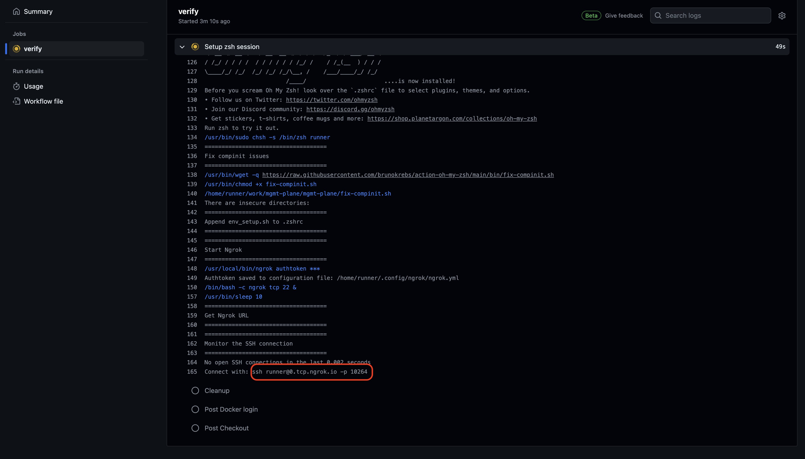

# GitHub Actions - Debugging with Oh My Zsh

This GitHub Actions workflow allows you to debug your own workflows using [Oh My Zsh](https://ohmyz.sh/) over SSH. That is, once configured, you can access the environment where the workflow is running and do whatever you can do with SSH, including opening a remote development experience with VSCode, running commands, and so on.

## Usage

The action will create an SSH tunnel using Ngrok and will provide you with the URL to access the environment. You can then use the URL to access the environment and debug your workflow.

The available options you have are:
- `ngrok-auth-token` (required): The Ngrok authentication token. You can create a new token [here](https://dashboard.ngrok.com/get-started/your-authtoken).
- `ssh-timeout`: The timeout for the SSH tunnel. Default is `300` seconds (5 minutes).
- `allowed-github-users`: A list of GitHub usernames that are allowed to access the environment.
- `allow-pr-owner`: A boolean to allow the PR owner to access the environment. Default is `false`.

You will have to set either the `allowed-github-users` or `allow-pr-owner` options to allow access to the environment. Otherwise, the action will fail.

```yaml
name: My Workflow Using Debugging Action

on: [push, pull_request]

jobs:
  debug-environment:
    runs-on: ubuntu-latest
    steps:
      - uses: actions/checkout@v4

      - name: Install Dependencies
        run: npm install

      - name: Run Tests
        run: npm test

      - name: Setup zsh session
        uses: brunokrebs/action-oh-my-zsh@v1
        if: failure()
        with:
          ngrok-auth-token: ${{ secrets.NGROK_AUTH_TOKEN }}
          ssh-timeout: 60
          allow-pr-owner: true
          allowed-github-users: "brunokrebs"
```

> Notice the `if: failure()` condition. This will only run the debugging action if the previous step fails. This is useful to avoid running the action when everything is working as expected.

## Preloading the environment

You can preload the environment with the tools you need by creating an `env_setup.sh` file in the `$HOME` directory. This file will be sourced when the SSH session is created, so you can add any environment variables or commands you need to run.

```yaml
- name: Prepare environment setup script
  if: failure()
  run: |
    echo "export PATH=/opt/hostedtoolcache/node/20.11.1/x64/bin:\$PATH" > $HOME/env_setup.sh
    echo "export PATH=/opt/hostedtoolcache/go/1.22.1/x64/bin:\$PATH" >> $HOME/env_setup.sh
```

> Add the above step before the `Setup zsh session` step to preload the environment with the tools you need.

## Security

The action will only allow access to the environment to the users you specify in the `allowed-github-users` option or to the PR owner if you set the `allow-pr-owner` option to `true`. This works by copying the public SSH key of the allowed users to the environment and configuring them as valid keys to the `runner` user.

## Accessing the environment

Once the action is running, you will see the following output in the logs:



## Development notes

To deploy a new version of the action, you will need to create a new tag and push it to the repository. GitHub will then create a new release and the action will be available to use in your workflows.

```bash
git tag -a v1 -m "First release"
git push origin v1
```
